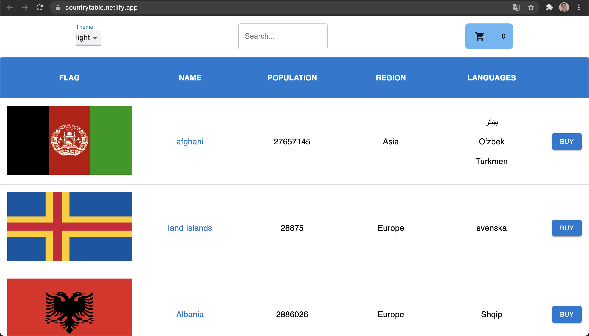

# Frontend React Project

This is your final project for the frontend module

## Instructions

### General

Fork this repo, then clone the **fork** to your machine and start working on it. You can open a pull request as soon as possible (no need to wait until finished)
For styling, you can use whatever css solution you want: css, scss, Material UI, etc.
You need to install the css library yourself. Make sure to use node-sass version 4.14.1 if you want to use scss (using other version may break the app, so switch to the above version in that case)

### Step 1

Write the first custom hook, that:

- Fetch all the countries and return the data
- Example usage of the hook is like this:

```
// countries variable will be an array of 250 countries
const [error, countries] = useCountries()
```

Write the second custom hook, that:

- Given a country name as argument (international or native), returns the data about that country from [countries APIs](https://restcountries.com/).
- Example usage of the hook is like this:

```
// country variable is an object, with details about Suomi (Finland)
const [error, country] = useCountry('Suomi')
```

### Step 2

- Use the first custom hook you created to fetch all the countries data
- Render this data in a table, you can use html table tag, or component library like Material UI
- Make sure to split the table into smaller components: `TableHead.js`, `TableBody.js`, `TableRow.js`

### Step 3

- Integrate react router into your project and create 2 pages: `home`, and `country`
- Homepage will contain the countries table that we created above
- Country page will render the data about one specific country only
- When a user click on the name of the country in the table, they will be routed to the `country` page

### Step 4

- Set up all the redux boilerblate for the project
- Everything related to redux stays in one folder: reducers, actions, store
- Think about what reducer you're going to make and write them accordingly
- Move the state that contains all countries to redux store
- Use `combineReducers` and have a default state for the `createStore`

### Step 5

- Integrate redux thunk, and fetch data from the thunk instead of inside the custom hooks

### Step 6

Convert the app to typescript

### Step 7

Take your time to implement the following features:

- Implement a search bar to search for a country
- Convert your hook to use either thunk or saga to fetch the data
- Switch theme of the app with Context API
- Add/remove the countries to/from favorite list using Redux, Redux-saga, Redux-thunk
- Sort the table based on name, region, etc.
- Maker sure the theme and favorite list is saved in local storage to persist across refreshes of the page (you can use thunk or saga to implement side effects that get state from the store and save it to local storage)

## References

[Demo](https://flagify.netlify.app/)

Homepage:


Country page:

